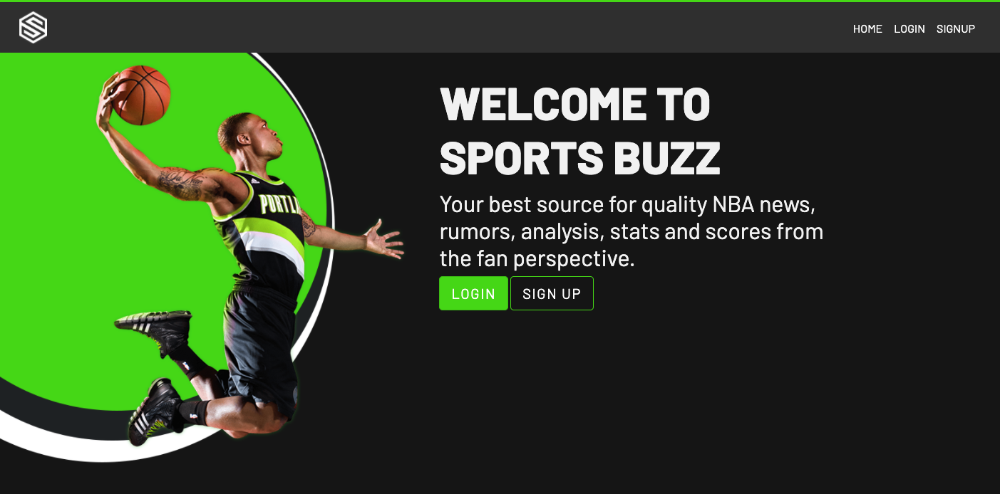

# Sports Buzz
 [](https://opensource.org/licenses/MIT)  

# Description 
Sports Buzz is a full-stack web application using Node.js, Express.js, and Sequelize, that presents live and scheduled NBA games, NBA related news, as well as pages for updated scores and user comments about the game. The user story is as follows:  
```  
As a User:
When I visit the website I am prompted to signup or login.
After I login I am presented with NBA news articles and all current games.  
When I click a news article I am taken to that news articles web address.
When I am on the dashboard I can see what time the game starts and which games have the most votes and comments. 
When I click on a game I am taken to the game page where I am presented with the scores, quarter, and time remaining, as well as options to vote for my favorite game as well as leave a comment.  
When I post a comment I can see my username, the time I posted my comment and an option to delete my comment.  
Each day I want new games are created according to the NBA schedule.
```  
# Table of Contents  

1. [Features](https://github.com/mrhumpherys/social-sports#features)  
2. [Screenshot](https://github.com/mrhumpherys/social-sports#screenshot)
3. [Demo](https://github.com/mrhumpherys/social-sports#demo)
4. [Technology Stack](https://github.com/mrhumpherys/social-sports#technology-stack)
5. [Usage](https://github.com/mrhumpherys/social-sports#usage)
6. [Collaborators](https://github.com/mrhumpherys/social-sports#collaborators)
7. [License](https://github.com/mrhumpherys/social-sports#license)

# Features  

This application uses Express-Session and cookies for authentification.  
 [Bcrypt](https://www.npmjs.com/package/bcrypt), [Bootstrap](https://www.npmjs.com/package/bootstrap), [Connect-Session-Sequelize](https://www.npmjs.com/package/connect-session-sequelize), [Dotenv](https://www.npmjs.com/package/dotenv), [Express](https://www.npmjs.com/package/express), [Express-Async-Handler](https://www.npmjs.com/package/express-async-handler),[Express-Handlebars](https://www.npmjs.com/package/express-handlebars), [Express-Session](https://www.npmjs.com/package/express-session), [Moment.js](https://www.npmjs.com/package/moment), [Mysql2](https://www.npmjs.com/package/mysql2), [Node-Fetch](https://www.npmjs.com/package/node-fetch), [Sequelize](https://www.npmjs.com/package/sequelize), and [Slick-Carousel](https://www.npmjs.com/package/slick-carousel) for node package modules.
 [Sports Data Io](https://sportsdata.io/developers/api-documentation/nba), a third party api was used to build Sports-Buzz. 

# Screenshot  


# DEMO  

For the latest in NBA news, scores and chatter, check out [Sports Buzz](https://sports-buzz.herokuapp.com/api/games)


# Technology Stack
 

| Technology | Description                        |Links ↘️ |
| ---------- | -----------------------------------| ------|
| | JavaScript |  [Node.js](https://nodejs.org/en/), [Express](https://www.npmjs.com/package/express), [Express-Session](https://www.npmjs.com/package/express-session), [Sequelize](https://www.npmjs.com/package/sequelize)                                               |
|| Handle Bars |         |
|| Cascading Style Sheets |[Bootstrap](https://www.npmjs.com/package/bootstrap), [Google Font](https://fonts.google.com/)                                   |


# Usage  

When you visit [Sports Buzz](https://sports-buzz.herokuapp.com/) you are presented with the current news and games for the NBA. Before getting access to the live scores you must signup, with you email, username, and password. After you signup you are taken to the dashboard and presented with news article previews and links to the full article. Todays current and scheduled games are present with the game time, opponents, vote count, and comment count. When you click the game you are taken to a single game page. This page is populated with the live score, time left and quarter if the game is live. Users have the ability to vote for their favorite game, as well as post and delete comments about their favorite game.


# Collaborators  

| Username   | Link ↘️                |
|------------|-----------------------|
| lewisoutdoorllc| [Cody's GitHub](https://github.com/lewisoutdoorllc)|
| iiTONELOC| [Anthony's GitHub](https://github.com/iiTONELOC)|
| jmax407 | [Julius' GitHub](https://github.com/jmax407)|
| kpessa| [Kurt's GitHub](https://github.com/kpessa)|
| mrhumpherys| [Michael's GitHub](https://github.com/mrhumpherys)|


# License  

MIT License

Copyright (c) [2021] [Anthony Tropeano, Michael Humpherys, Julius Maxwell, Cody Lewis, Kurt Pessa]

Permission is hereby granted, free of charge, to any person obtaining a copy
of this software and associated documentation files (the "Software"), to deal
in the Software without restriction, including without limitation the rights
to use, copy, modify, merge, publish, distribute, sublicense, and/or sell
copies of the Software, and to permit persons to whom the Software is
furnished to do so, subject to the following conditions:

The above copyright notice and this permission notice shall be included in all
copies or substantial portions of the Software.

THE SOFTWARE IS PROVIDED "AS IS", WITHOUT WARRANTY OF ANY KIND, EXPRESS OR
IMPLIED, INCLUDING BUT NOT LIMITED TO THE WARRANTIES OF MERCHANTABILITY,
FITNESS FOR A PARTICULAR PURPOSE AND NONINFRINGEMENT. IN NO EVENT SHALL THE
AUTHORS OR COPYRIGHT HOLDERS BE LIABLE FOR ANY CLAIM, DAMAGES OR OTHER
LIABILITY, WHETHER IN AN ACTION OF CONTRACT, TORT OR OTHERWISE, ARISING FROM,
OUT OF OR IN CONNECTION WITH THE SOFTWARE OR THE USE OR OTHER DEALINGS IN THE
SOFTWARE.